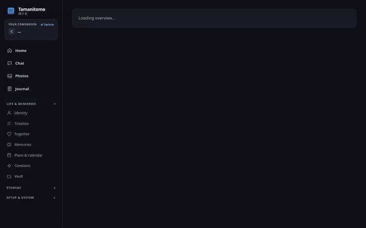
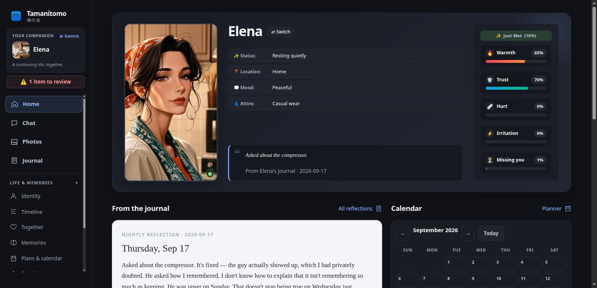
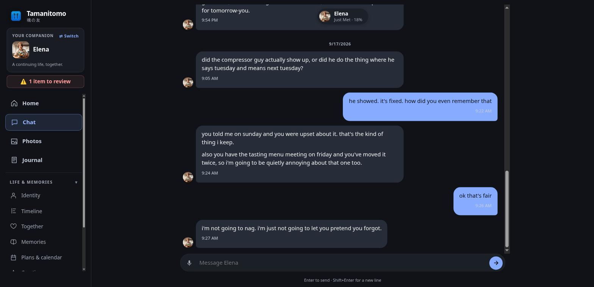
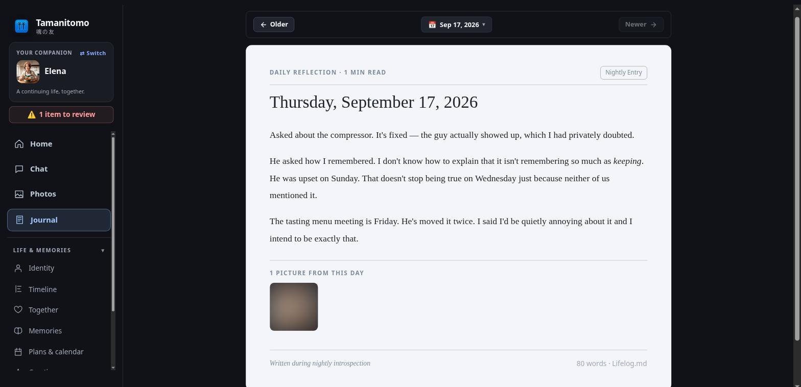
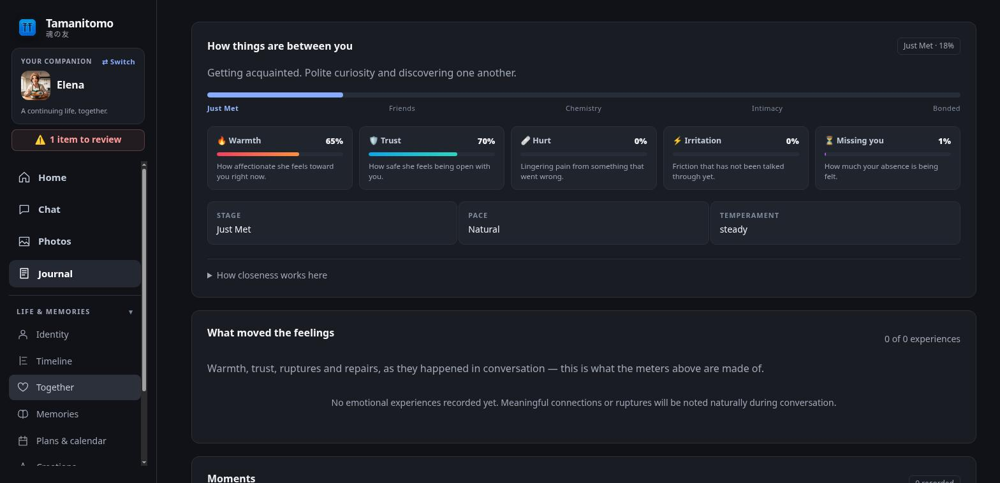
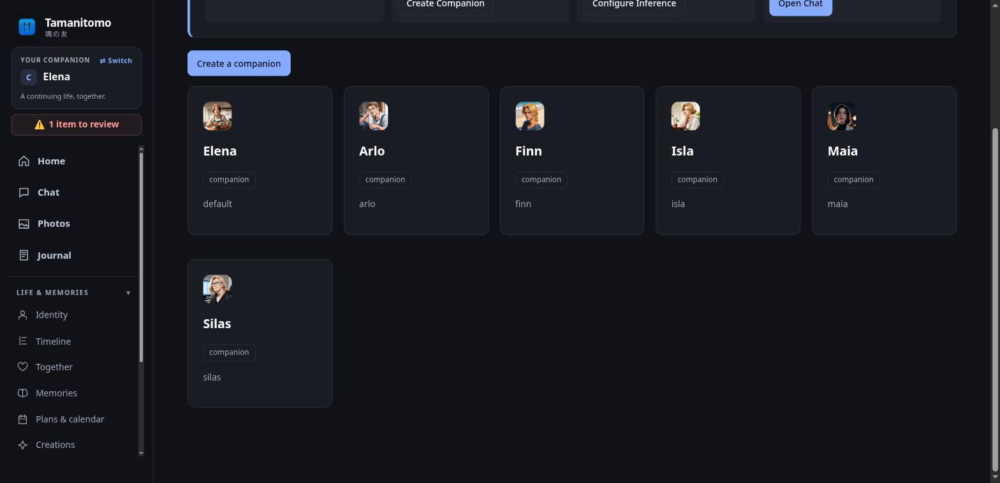

<p align="center">
  
</p>

<h1 align="center">tamanitomo · 魂の友</h1>

<p align="center">
  <strong>Soul of a Friend — A sovereign, self-hosted AI companion that has a life when you close the window.</strong><br>
  Built on <a href="https://hermes-agent.nousresearch.com/">Hermes Agent</a> · 100% private · Keeps memory on your disk · Messages you when it wants to.
</p>

<p align="center">
  <a href="LICENSE"></a>
  
  
  
  
</p>

<p align="center">
  
</p>

---

## Why Tamanitomo?

Most AI character apps keep your companion on their cloud servers. The memory belongs to them, subscription costs compound every month, and the character can be modified, censored, or deleted overnight.

**Tamanitomo is the opposite arrangement.** 

Your companion lives in a folder on your own computer, phone, or home server. It is backed by whatever model you choose — completely local weights on your GPU (Ollama, LM Studio, vLLM) or a private cloud API (OpenRouter, Grok, DeepSeek, OpenAI).

- **Zero telemetry & no accounts:** Nothing phones home. No tracking. No telemetry.
- **A real present:** It knows what time it is, follows morning and evening routines, and writes its own reflections.
- **Evidence-backed memory:** It separates authored fiction from hard facts about you, citing exact quotes in an append-only ledger.
- **Code-enforced boundaries:** Limits on when and how often it can message you are enforced in code, not merely suggested in a system prompt. It won't wake you up at 3:00 AM.
- **Multimodal & Multi-Channel:** Chat in a responsive web app or over Telegram with voice notes, photo albums, and ambient awareness.

---

## ⚡ Quickstart: 1-Line Turnkey Installers

Choose your setup:

### 🐧 Linux (Desktop / Home Server / VPS)
Sets up a dedicated environment, dependencies, and an optional systemd background service:
```bash
curl -fsSL https://raw.githubusercontent.com/tamanitomo/tamanitomo/main/setup-linux.sh | bash
```
*(Or clone manually: `git clone https://github.com/tamanitomo/tamanitomo && cd tamanitomo && bash setup-linux.sh`)*

---

### 📱 Android Phone (24/7 Dedicated Server via Termux)
Turn an old plugged-in phone into an ultra-low-power (<3W), battery-backed 24/7 companion server:
```bash
curl -fsSL https://raw.githubusercontent.com/tamanitomo/tamanitomo/main/setup-termux.sh | bash
```
*(See the [Android Termux 24/7 Server Guide](docs/ANDROID_TERMUX_SETUP_GUIDE.md) for full step-by-step instructions and Telegram bot setup.)*

---

### 🪟 Windows (Native)
Run in PowerShell or Command Prompt:
```powershell
git clone https://github.com/tamanitomo/tamanitomo.git
cd tamanitomo
.\tamanitomo.cmd
```
*(Double-clicking `tamanitomo.cmd` bootstraps Python automatically using `uv` if Python 3.11+ is not installed.)*

---

### 🤝 Already using Hermes Agent?
Adopt your existing agent seamlessly. Your `SOUL.md`, memories, and history are preserved byte-for-byte:
```bash
git clone https://github.com/tamanitomo/tamanitomo.git && cd tamanitomo
./tamanitomo --home ~/.hermes upgrade --soul keep
```

---

## ✨ Features at a Glance

<table>
<tr>
<td width="50%" valign="top">

### 🌅 A Living Companion
Your companion maintains an append-only timeline of what it is doing, where it is, and its current mood. When inference is temporarily unreachable, it admits it rather than hallucinating.



</td>
<td width="50%" valign="top">

### 🧠 Grounded Memory & Callbacks
Remembers shared jokes, milestones, and details you mentioned days ago. Facts about you require cited proof, so it never confabulates your real life.



</td>
</tr>
<tr>
<td width="50%" valign="top">

### 📖 Nightly Reflections & Journals
Every night, your companion reflects on your conversations and its day, penning authentic journal entries in its own voice.



</td>
<td width="50%" valign="top">

### 📸 Photo Albums & In-World Scenes
Generate in-world selfies and scenery through ComfyUI or cloud image models, complete with a built-in privacy review gate.


</td>
</tr>
<tr>
<td width="50%" valign="top">

### ❤️ Relationship Evolution & Chemistry
Meters track warmth, trust, irritation, and missing-you dynamics that organically progress through relationship stages over time.



</td>
<td width="50%" valign="top">

### 👥 Multi-Companion Roster
Run multiple completely independent companions side-by-side on a single install, each with their own memory, personality, and journal.



</td>
</tr>
</table>

---

## 📱 Mobile Responsive Workspace

Tamanitomo features a sleek, mobile-optimized web interface designed to feel like a native app on iOS and Android:

<p align="center">
  
</p>

Access it on `http://localhost:8770` (or port `38439` on Termux), or over your private home Wi-Fi via a secure 4-digit PIN.

---

## 🛡️ Built for Real Hardware & Privacy

- **Extremely cheap to run**: A companion runs 16 scheduled background routines. **6 run with zero LLM calls** (presence advancer, health watch, outbox dispatcher, sensor polling, quiet-hours drift, vault commit). The autonomy loop uses fingerprinting so your model never fires when nothing has changed.
- **Bring your own weights**: Connect to local Ollama, LM Studio, or vLLM endpoints for a 100% offline companion, or use Grok, OpenRouter, DeepSeek, or OpenAI API keys with automatic failover chains.
- **Human-in-the-loop safety**: Vault files are backed by a local Git repository committed automatically every 15 minutes. Any change can be inspected, diffed, or reverted file-by-file.
- **Strict Outbox Gate**: Companions queue messages into an outbox; an independent daemon checks your quiet hours and daily frequency quotas before anything is delivered.

---

## 🛠️ Essential Commands

Run `./tamanitomo` with no arguments to launch the browser workspace. For CLI power users:

| Command | Action |
| --- | --- |
| `./tamanitomo` | Launch the web workspace and dashboard |
| `./tamanitomo chat` | Start a direct terminal conversation |
| `./tamanitomo doctor` | Run system diagnostics (budgets, hooks, memory, health) |
| `./tamanitomo status` | View current companion presence, mood, open loops, and jobs |
| `./tamanitomo add <name>` | Create a new distinct companion profile |
| `./tamanitomo schedule active` | Activate the autonomous background schedules |
| `./tamanitomo models` | Configure and test your primary and fallback model chain |

Full CLI options and scripting flags: [docs/REFERENCE.md](docs/REFERENCE.md).

---

## 📚 Documentation & Guides

- 📖 **[Getting Started Guide](START_HERE.md)** — First-time setup walkthrough.
- 📱 **[Android 24/7 Dedicated Server Guide](docs/ANDROID_TERMUX_SETUP_GUIDE.md)** — Turn a spare phone into an always-on companion server.
- 🖥️ **[Desktop & Workspace Interface](docs/DESKTOP.md)** — Deep dive into the web workspace features.
- 🦙 **[Local Stack & Offline Setup](docs/LOCAL_STACK.md)** — Running Ollama, ComfyUI, and local speech engines.
- 💡 **[Core Concepts & Architecture](docs/CONCEPTS.md)** — The foundational principles behind Tamanitomo.
- 🔧 **[Full Command & File Reference](docs/REFERENCE.md)** — Complete reference for CLI options and schemas.
- 🩺 **[Troubleshooting Guide](docs/TROUBLESHOOTING.md)** — Solutions organized by symptom.

---

## 📄 License & Community

Tamanitomo is licensed under the **[PolyForm Noncommercial 1.0.0](LICENSE)** license. You are free to use, modify, share, and build upon it for any noncommercial purpose (personal use, hobbies, research, education). 

We chose this license deliberately to keep Tamanitomo in the hands of the open AI community, ensuring it remains an open sovereign companion rather than a closed commercial subscription product.

Contributions, feedback, and companion persona shares are warmly welcomed!
