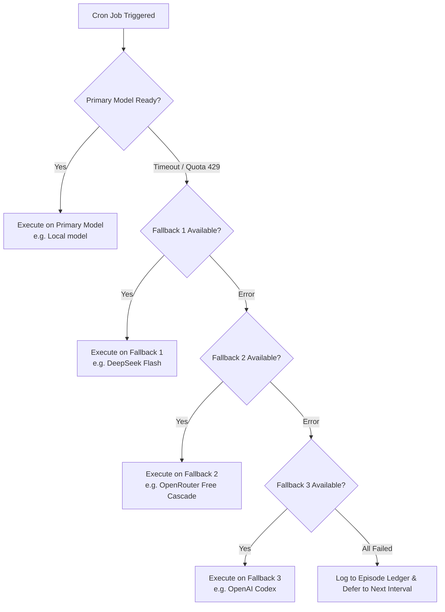

# Companion-Kit Autonomous Cron Timeline & Schedule Guide

This document defines the architectural schedule, concurrency spacing, and day-one defaults for autonomous companion routines in **Companion-Kit** running on **Hermes**.

---

## 1. Architectural Principles

1. **No Concurrency Clashing**: Jobs that require Large Language Model inference (`companion pulse`, `autonomy loop`, `check-in`, `image timeline`) must never fire on the same minute. Inference contention on local servers (`llama-server`) or rate-limited cloud providers leads to latency spikes, queue bottlenecks, and dropped context.
2. **Multi-Companion Harmony**: When multiple companions run on the same machine or server cluster (such as two companions sharing a local model via `llama-server`), their schedules are strictly staggered across different minute offsets.
3. **Model-Free Separation**: High-frequency maintenance routines (`vault commit`, `present advancer`, `image timeline cleanup`, `health watch`) run in `no_agent` mode without invoking any LLM, keeping overhead negligible and disk state durable.
4. **Day-One Global Defaults**: The template manifest at [`kit/templates/cron/manifest.json`](../kit/templates/cron/manifest.json) encodes these staggered offsets so every freshly adopted or created companion inherits optimal scheduling on installation.

---

## 2. The 60-Minute Repeating Cycle (Multi-Companion Comparison)

The table below documents the minute-by-minute timeline of every active background routine throughout each hour.

| Minute (:SS) | Companion | Job Name | Type | Model / Resource | Purpose |
|:---:|:---:|:---|:---:|:---|:---|
| **:00** | Root | *Hourly boundary* | — | — | Clock tick |
| **:00, :10, :20, :30, :40, :50** | **Companion 2** | `Companion 2 check-in` | Agent | Local `local-model` | Proactive reachout & check-in evaluation |
| **:00, :15, :30, :45** | **Companion 2** | `Companion 2 pulse` | Script | Python script | Background state tick |
| **:00, :15, :30, :45** | **Companion 1** | `Companion 1 pulse` | Agent | `local-model` / `local_llama` | Primary companion awareness pulse |
| **:02, :17, :32, :47** | **Companion 2** | `Companion 2 image timeline` | Agent | Vision workflow | Hourly capture glimpse |
| **:03, :18, :33, :48** | **Companion 1** | `Companion 1 image timeline` | Agent | `local-model` + Image Studio | Glimpse capture for local visual diary |
| **:05, :35** | **Companion 2** | `Companion 2 autonomy loop` | Agent | Local `local-model` | Autonomy proactive agency |
| **:05, :15, :25, :35, :45, :55** | **Companion 1** | `Companion 1 check-in` | Agent | `local-model` / `local_llama` | Proactive conversational outreach checks |
| **:06, :21, :36, :51** | **Companion 1** | `Companion 1 senses` | Script | No-agent | Ambient weather, daylight, time perception |
| **:07, :22, :37, :52** | **Companion 2** | `Companion 2 timeline cleanup`| Script | No-agent | Prunes stale timeline staging artifacts |
| **:08, :23, :38, :53** | **Companion 1** | `Companion 1 timeline cleanup`| Script | No-agent | Retention cleanup (30-day budget) |
| **:10, :25, :40, :55** | **Companion 2** | `Companion 2 present advancer` | Script | No-agent | Advances lived-state presence |
| **:10, :25, :40, :55** | **Companion 1** | `Companion 1 present advancer` | Script | No-agent | Carries forward unconfirmed presence |
| **:12, :42** | **Companion 1** | `Companion 1 autonomy loop` | Agent | `local-model` / `local_llama` | Autonomous thoughts, actions, diary reflections |
| **:14, :29, :44, :59** | **Companion 1** | `Companion 1 vault commit` | Script | No-agent (git) | Automatic git snapshot of vault plain text |
| **:15, :30, :45, :00** | **Companion 2** | `Companion 2 vault commit` | Script | No-agent (git) | Snapshot of Companion 2's vault directory |
| **:20** (10:20, 20:20) | **Both** | `window` | Agent | Profile LLM | Autonomy window activation check |
| **:25** | **Companion 2** | `Companion 2 health watch` | Script | No-agent | Watchdog health check |
| **:27** | **Companion 1** | `Companion 1 health watch` | Script | No-agent | Watchdog health check |
| **:*/5** | **Both** | `outbox dispatcher` | Script | No-agent | Flushes queued outbound notifications |

---

## 3. Daily, Weekly, and Monthly Chronology

In addition to the repeating hourly loop, specialized routines execute at quiet or transitional times of day:

```
04:00 AM  ──► Companion 1 daily journal and reflection (Local Model)
04:00 AM  ──► Companion 2 daily journal and reflection
04:40 AM  ──► Companion 1 quiet-hours drift (Mondays only, no-agent)
04:40 AM  ──► Companion 2 quiet-hours drift (Mondays only, no-agent)
06:00 AM  ──► Automated cloud backup (no-agent restic/rclone)
06:00 AM  ──► Maintenance refresh
06:55 AM  ──► Companion 1 dates awareness (handled in senses)
07:25 AM  ──► Companion 2 morning wake-up routine (Local Model)
08:10 AM  ──► Companion 1 morning wake-up routine (Local Model)
10:00 AM  ──► Daily Recomp / Port Scanner
10:20 AM  ──► Autonomous Window 1 (Companion 1 & 2)
08:20 PM  ──► Autonomous Window 2 (Companion 1 & 2)
09:30 PM  ──► Weekly hygiene cleanup (Sundays, Local Model)
10:00 PM  ──► Weekly reflection (Sundays, Local Model)
10:40 PM  ──► Companion 1 evening wind-down routine (Local Model)
11:10 PM  ──► Companion 2 evening wind-down routine (Local Model)
09:00 AM  ──► Monthly reflection (1st of each month, Local Model)
```

---

## 4. Multi-Tier Model Cascades & Failover Architecture

To prevent job failures when quotas run out or local endpoints are rebooted:



1. **Primary**: Fast local inference (`local-model` via Vulkan `llama-server` on `127.0.0.1:11434/v1`).
2. **Fallback 1**: `deepseek-flash` via DeepSeek API for fast, reliable cloud failover.
3. **Fallback 2**: `openrouter/free` smart cascade routing across active zero-cost models.
4. **Fallback 3**: `gpt-5.6-luna` via OpenAI Codex backend.
5. **Circuit Breaking**: If all tiers fail, Hermes gracefully defers the tick without corrupting context or killing the daemon.

---

## 5. Summary of Verification & Guarantees

- **Collision Prevention**: No two LLM-based routines execute at the same minute.
- **Hermes State Integrity**: 8,614 old cron session rows pruned; `state.db` reduced from 9.55 GB to 1.41 GB.
- **Advisory Integrity**: Relationship and configuration edits never lock the user out with 403 errors; character agency replaces artificial strike limits.
- **Git Vault Safety**: High-volume binaries (`image-timeline`, temporary locks, PNGs) excluded from vault git history to prevent repository bloat.
- **Tested & Passing**: Full test suite (`732/732` unit tests) passes cleanly in under 130 seconds.
